# explorer.exe

## Activity

- [docs](https://github.com/lowlighter/metrics/blob/master/source/plugins/activity/README.md)

## Calendar

- [docs](https://github.com/lowlighter/metrics/blob/master/source/plugins/calendar/README.md)

Collapsed due to image size

## Follow Up

- [docs](https://github.com/lowlighter/metrics/blob/master/source/plugins/followup/README.md)

## Habit Chart

- [docs](https://github.com/lowlighter/metrics/blob/master/source/plugins/habits/README.md)

## Intro

- [docs](https://github.com/lowlighter/metrics/blob/master/source/plugins/introduction/README.md)

## Last.fm

- [docs](https://github.com/lowlighter/metrics/blob/master/source/plugins/music/README.md)

## Notable contributions

- [docs](https://github.com/lowlighter/metrics/blob/master/source/plugins/notable/README.md)

## Sponsors

- [docs](https://github.com/lowlighter/metrics/blob/master/source/plugins/sponsors/README.md)

## Steam

- [docs](https://github.com/lowlighter/metrics/blob/master/source/plugins/steam/README.md)

## Wakatime

- [docs](https://github.com/lowlighter/metrics/blob/master/source/plugins/wakatime/README.md)

